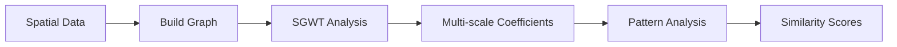

# BioGSP: Biological Graph Signal Processing

[](https://github.com/BMEngineeR/BioGSP)

## What is BioGSP?

BioGSP is an R package that brings **Graph Signal Processing** to biological data analysis. It provides tools for analyzing spatial patterns in biological data using advanced mathematical techniques from graph theory and signal processing.

## What is SGWT?

**Spectral Graph Wavelet Transform (SGWT)** is a mathematical technique that extends classical wavelet analysis to graphs and irregular spatial domains. Think of it as a "microscope" that can examine spatial patterns at different scales simultaneously:

-  **Multi-scale Analysis**: See both fine details and broad patterns in your spatial data
-  **Frequency Decomposition**: Separate smooth background patterns from sharp spatial features  
-  **Irregular Domains**: Works with any spatial layout, not just regular grids
-  **Perfect Reconstruction**: Can perfectly reconstruct your original signal from the decomposition

## What is SGCC?

**Spectral Graph Cross-Correlation (SGCC)** measures how similar two spatial patterns are across different scales:

-  **Pattern Comparison**: Compare two spatial signals on the same graph structure
-  **Multi-scale Similarity**: Considers both fine-scale and broad-scale similarities
-  **Energy Normalized**: Fair comparison regardless of signal magnitude
-  **Robust Metric**: Ranges from -1 to 1, where higher values indicate greater similarity

## How This Package Works



1. **Input**: Your spatial data (coordinates + measurements)
2. **Graph Construction**: Automatically builds a graph connecting nearby points
3. **SGWT Decomposition**: Breaks down spatial patterns into different scales
4. **Analysis**: Compute energy, similarity, and other spatial statistics
5. **Output**: Interpretable results and visualizations

## Installation

Install BioGSP directly from GitHub:

```r
# Install devtools if you haven't already
if (!requireNamespace("devtools", quietly = TRUE)) {
  install.packages("devtools")
}

# Install BioGSP from GitHub
devtools::install_github("BMEngineeR/BioGSP")
```

## Quick Start

### Basic Analysis

```r
library(BioGSP)

# Your data should have: x, y coordinates and a signal
# Example with synthetic data
set.seed(123)
demo_data <- data.frame(
  x = rep(1:10, each = 10) + rnorm(100, 0, 0.1),
  y = rep(1:10, times = 10) + rnorm(100, 0, 0.1),
  signal = sin(0.5 * rep(1:10, each = 10)) + rnorm(100, 0, 0.1)
)

# Run SGWT analysis
result <- SGWT(data.in = demo_data, signal = "signal", k = 8, J = 4, k_fold = 8)

# Check quality
print(paste("Reconstruction error:", round(result$reconstruction_error, 6)))

# Analyze energy distribution across scales
energy_analysis <- sgwt_energy_analysis(result)
print(energy_analysis)
```

### Compare Two Spatial Patterns

```r
# Create two related signals
demo_data$signal2 <- cos(0.3 * demo_data$y) + rnorm(100, 0, 0.1)

# Calculate similarity between signals
similarity <- sgwt_similarity("signal", "signal2", 
                             data.in = demo_data, 
                             k = 8, J = 4, k_fold = 8)
print(paste("SGCC Score:", round(similarity, 4)))
```

## Use Cases

### Biological Applications
- **Spatial Transcriptomics**: Compare gene expression patterns across tissue regions
- **Single-cell Analysis**: Analyze spatial organization of cell types
- **Cancer Research**: Identify spatial heterogeneity in tumors
- **Developmental Biology**: Track pattern formation during development

### Research Applications
- **Neuroscience**: Brain connectivity and neural signal analysis
- **Environmental Science**: Spatial patterns in ecological data
- **Medical Imaging**: Multi-scale analysis of medical images
- **Social Networks**: Analyze signals on network data

### Data Analysis Tasks
- **Pattern Discovery**: Find recurring spatial motifs
- **Quality Control**: Assess spatial consistency in experiments
- **Batch Effect Detection**: Compare datasets for systematic differences
- **Multi-modal Integration**: Correlate different measurement types

## Key Functions

| Function | Purpose |
|----------|---------|
| `SGWT()` | Main SGWT analysis function |
| `sgwt_similarity()` | Compare two spatial patterns |
| `sgwt_energy_analysis()` | Analyze energy across scales |
| `plot_sgwt_decomposition()` | Visualize results |

## Learn More

- **Detailed Documentation**: See [developer_README.md](developer_README.md) for comprehensive function documentation
- **Mathematical Theory**: Learn about the underlying graph signal processing concepts
- **Advanced Examples**: Explore complex analysis workflows
- **API Reference**: Complete function specifications and parameters

## Quick Help

**Common Issues:**
- **"Graph construction failed"**: Try reducing `k` (number of neighbors)
- **"Eigendecomposition error"**: Adjust `k_fold` parameter (try `k_fold = 5-8` for small datasets)
- **"k must satisfy 0 < k < nrow(A)"**: Use smaller `k_fold` (for N points, use `k_fold < N/sqrt(N)`)
- **"Reconstruction error high"**: Normal for noisy data, check if < 0.01

**Getting Started:**
1. Prepare data with x, y coordinates and signal values
2. Start with `k=8-15` neighbors, `J=3-5` scales, and `k_fold=5-8`
3. For small datasets (<200 points), use smaller `k_fold` values
4. Check reconstruction error to validate results
5. Use energy analysis to understand your data's scale distribution

## References

- Hammond, D. K., Vandergheynst, P., & Gribonval, R. (2011). Wavelets on graphs via spectral graph theory. *Applied and Computational Harmonic Analysis*, 30(2), 129-150.

## Support

- **Issues**: [GitHub Issues](https://github.com/BMEngineeR/BioGSP/issues)
- **Questions**: Open a GitHub issue for help
- **Contributing**: Pull requests welcome!

---

**License**: GPL-3 | **Maintainer**: BMEngineeR