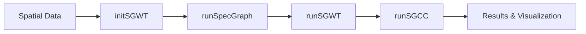

# BioGSP: Biological Graph Signal Processing

[](https://github.com/BMEngineeR/BioGSP) 

## What is BioGSP? 

BioGSP is an R package that brings **Graph Signal Processing** to biological data analysis. It provides tools for analyzing spatial patterns in biological data using advanced mathematical techniques from graph theory and signal processing.

<br>

BioGSP is an R package that brings **Graph Signal Processing** to biological data analysis. It provides tools for analyzing spatial patterns in biological data using advanced mathematical techniques from graph theory and signal processing.

## What is SGWT?

**Spectral Graph Wavelet Transform (SGWT)** is a mathematical technique that extends classical wavelet analysis to graphs and irregular spatial domains. Think of it as a "microscope" that can examine spatial patterns at different scales simultaneously:

-  **Multi-scale Analysis**: See both fine details and broad patterns in your spatial data
-  **Frequency Decomposition**: Separate smooth background patterns from sharp spatial features  
-  **Irregular Domains**: Works with any spatial layout, not just regular grids
-  **Perfect Reconstruction**: Can perfectly reconstruct your original signal from the decomposition

## What is SGCC?

**Spectral Graph Cross-Correlation (SGCC)** measures how similar two spatial patterns are across different scales using Fourier domain analysis:

-  **Fourier Domain Computation**: Works directly with spectral coefficients for mathematical accuracy
-  **DC Component Exclusion**: Ignores constant offset (λ = 0) to focus on meaningful spatial patterns
-  **Multi-scale Similarity**: Considers both fine-scale and broad-scale similarities
-  **Energy Normalized**: Fair comparison using Parseval's theorem-consistent energy weighting
-  **Robust Metric**: Ranges from -1 to 1, where higher values indicate greater similarity

## How This Package Works



**Workflow**
1. **`initSGWT()`**: Initialize SGWT object with your spatial data and parameters
2. **`runSpecGraph()`**: Build graph structure (adjacency, Laplacian, eigendecomposition) and auto-generate scales
3. **`runSGWT()`**: Perform forward and inverse SGWT transforms on all signals
4. **`runSGCC()`**: Calculate Fourier domain weighted similarity between signals (excludes DC component)
5. **Visualization**: Use updated plotting functions with Fourier domain energy analysis

## Installation

Install BioGSP directly from GitHub:

```r
# Install devtools if you haven't already
if (!requireNamespace("devtools", quietly = TRUE)) {
  install.packages("devtools")
}

# Install BioGSP from GitHub
devtools::install_github("BMEngineeR/BioGSP")
```

## Quick Start

### Workflow (Recommended)

```r
library(BioGSP)

# Your data should have: x, y coordinates and signal(s)
# Example with synthetic data
set.seed(123)
demo_data <- data.frame(
  x = rep(1:10, each = 10) ,
  y = rep(1:10, times = 10),
  signal1 = sin(0.5 * rep(1:10, each = 10)) + rnorm(100, 0, 0.1),
  signal2 = cos(0.3 * rep(1:10, times = 10)) + rnorm(100, 0, 0.1)
)

# Step 1: Initialize SGWT object
SG <- initSGWT(demo_data, 
               signals = c("signal1", "signal2"), 
               J = 4, 
               kernel_type = "heat")

# Step 2: Build spectral graph (scales auto-generated based on eigenvalues)
SG <- runSpecGraph(SG, k = 8, laplacian_type = "normalized", length_eigenvalue = 30)

# Visualize Fourier modes (eigenvectors) - 5 low and 5 high frequency modes
fourier_modes <- plot_FM(SG, mode_type = "both", n_modes = 5, ncol = 5)
print(fourier_modes)

# Step 3: Run SGWT analysis
SG <- runSGWT(SG)

# Step 4: Check results
print(SG)

# Analyze energy distribution (Fourier domain, excludes DC component)
energy_analysis <- sgwt_energy_analysis(SG, "signal1")
print(energy_analysis)

# Visualize decomposition
plots <- plot_sgwt_decomposition(SG, "signal1")
print(plots)
```

### Compare Two Spatial Patterns

```r
# Calculate Fourier domain similarity between signals in the same SGWT object
similarity <- runSGCC("signal1", "signal2", SG = SG)
print(paste("SGCC Score:", round(similarity$S, 4)))
print(paste("Low-frequency similarity:", round(similarity$c_low, 4)))
print(paste("High-frequency similarity:", round(similarity$c_nonlow, 4)))
print(paste("Energy weights - Low:", round(similarity$w_low, 4), "High:", round(similarity$w_NL, 4)))
```

### Visualize Similarity Space

```r
# Generate multiple patterns for similarity analysis
patterns <- simulate_multiscale(
  grid_size = 40,
  Ra_seq = c(5, 10, 15),   # Inner circle radii
  n_steps = 5,             # Number of shrinkage steps
  n_centers = 1,
  outer_start = 25,        # Fixed starting outer radius
  seed = 123
)

# Process patterns and compute similarities
similarity_results <- list()
for (i in seq_along(patterns)) {
  pattern_name <- names(patterns)[i]
  pattern_data <- patterns[[i]]
  
  # Create and process SGWT object
  SG_temp <- initSGWT(pattern_data, x_col = "X", y_col = "Y", 
                     signals = c("signal_1", "signal_2"), J = 4)
  SG_temp <- runSpecGraph(SG_temp, k = 12, verbose = FALSE)
  SG_temp <- runSGWT(SG_temp, verbose = FALSE)
  
  # Compute within-pattern similarity
  similarity_results[[pattern_name]] <- runSGCC("signal_1", "signal_2", 
                                               SG = SG_temp, return_parts = TRUE)
}

# Visualize similarity space: low-frequency vs non-low-frequency
similarity_plot <- visualize_similarity_xy(
  similarity_results,
  point_size = 4,
  add_diagonal = TRUE,
  add_axes_lines = TRUE,
  title = "SGWT Similarity Space: 9 Pattern Comparisons",
  show_labels = TRUE
)
print(similarity_plot)
```

### Moving Circles Pattern Analysis

```r
# Generate moving circles patterns with mutual exclusion
moving_patterns <- simulate_moving_circles(
  grid_size = 40,
  radius_seq = c(6, 10, 14),  # Three different radii
  n_steps = 5,                # Five movement steps
  center_distance = 20,       # Initial distance from center
  radius2_factor = 1.3        # Second circle is 1.3x larger
)

# Visualize the patterns
moving_viz <- visualize_moving_circles(moving_patterns)
print(moving_viz)

# Analyze one pattern with SGWT
selected_pattern <- moving_patterns[["Ra_10_Step_3"]]
SG_moving <- initSGWT(selected_pattern, x_col = "X", y_col = "Y", 
                     signals = c("signal_1", "signal_2"), J = 4)
SG_moving <- runSpecGraph(SG_moving, k = 12, verbose = FALSE)
SG_moving <- runSGWT(SG_moving, verbose = FALSE)

# Calculate similarity between moving circles
similarity <- runSGCC("signal_1", "signal_2", SG = SG_moving, return_parts = TRUE)
print(paste("Moving circles similarity:", round(similarity$S, 4)))
```

## SGWT Object Structure

The new SGWT object contains:

- **Data**: Original data, coordinate columns, signal names
- **Graph**: Adjacency matrix, Laplacian matrix, eigenvalues, eigenvectors
- **Forward**: SGWT forward transform results (original and filtered Fourier coefficients, filters)
- **Inverse**: Inverse transform results (vertex approximations, reconstructed signal, reconstruction error)
- **Parameters**: All analysis parameters (scales, J, kernel_type, etc.) - scales auto-generated in runSpecGraph

## Use Cases

### Biological Applications
- **Spatial Transcriptomics**: Compare gene expression patterns across tissue regions
- **Single-cell Analysis**: Analyze the spatial organization of cell types
- **Cancer Research**: Identify spatial heterogeneity in tumors
- **Developmental Biology**: Track pattern formation during development


## Key Functions

| Function | Purpose |
|----------|---------|
| `initSGWT()` | Initialize SGWT object with data and parameters |
| `runSpecGraph()` | Build spectral graph structure and auto-generate scales |
| `runSGWT()` | Perform SGWT forward and inverse transforms |
| `runSGCC()` | Calculate Fourier domain energy-normalized weighted similarity (excludes DC) |
| `plot_sgwt_decomposition()` | Visualize SGWT results |
| `sgwt_energy_analysis()` | Analyze energy distribution across scales in Fourier domain (excludes DC) |
| `visualize_similarity_xy()` | Plot similarity space: low-frequency vs non-low-frequency |
| `simulate_multiscale()` | Generate concentric ring patterns with varying radii |
| `simulate_moving_circles()` | Generate moving circles patterns with mutual exclusion |
| `visualize_multiscale()` | Visualize concentric ring patterns |
| `visualize_moving_circles()` | Visualize moving circles patterns |
| `demo_sgwt()` | Run complete demonstration |

## Advanced Features

### Multiple Kernel Types
```r
# Try different wavelet kernels
SG_mexican <- initSGWT(demo_data, kernel_type = "mexican_hat")
SG_meyer <- initSGWT(demo_data, kernel_type = "meyer") 
SG_heat <- initSGWT(demo_data, kernel_type = "heat")  # Default
```

## Support

- **Issues**: [GitHub Issues](https://github.com/BMEngineeR/BioGSP/issues)
- **Questions**: Open a GitHub issue for help
- **Contributing**: Pull requests welcome!

---

**License**: GPL-3 | **Maintainer**: Yuzhou Chang
