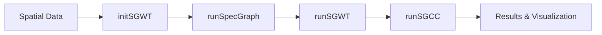

# BioGSP: Biological Graph Signal Processing

[](https://github.com/BMEngineeR/BioGSP)

## What is BioGSP?

BioGSP is an R package that brings **Graph Signal Processing** to biological data analysis. It provides tools for analyzing spatial patterns in biological data using advanced mathematical techniques from graph theory and signal processing.

## What is SGWT?

**Spectral Graph Wavelet Transform (SGWT)** is a mathematical technique that extends classical wavelet analysis to graphs and irregular spatial domains. Think of it as a "microscope" that can examine spatial patterns at different scales simultaneously:

-  **Multi-scale Analysis**: See both fine details and broad patterns in your spatial data
-  **Frequency Decomposition**: Separate smooth background patterns from sharp spatial features  
-  **Irregular Domains**: Works with any spatial layout, not just regular grids
-  **Perfect Reconstruction**: Can perfectly reconstruct your original signal from the decomposition

## What is SGCC?

**Spectral Graph Cross-Correlation (SGCC)** measures how similar two spatial patterns are across different scales:

-  **Pattern Comparison**: Compare two spatial signals on the same graph structure
-  **Multi-scale Similarity**: Considers both fine-scale and broad-scale similarities
-  **Energy Normalized**: Fair comparison regardless of signal magnitude
-  **Robust Metric**: Ranges from -1 to 1, where higher values indicate greater similarity

## How This Package Works



**New Workflow (v2.0+):**
1. **`initSGWT()`**: Initialize SGWT object with your spatial data and parameters
2. **`runSpecGraph()`**: Build graph structure (adjacency, Laplacian, eigendecomposition)
3. **`runSGWT()`**: Perform forward and inverse SGWT transforms on all signals
4. **`runSGCC()`**: Calculate weighted similarity between signals
5. **Visualization**: Use updated plotting functions for comprehensive analysis

## Installation

Install BioGSP directly from GitHub:

```r
# Install devtools if you haven't already
if (!requireNamespace("devtools", quietly = TRUE)) {
  install.packages("devtools")
}

# Install BioGSP from GitHub
devtools::install_github("BMEngineeR/BioGSP")
```

## Quick Start

### New Workflow (Recommended)

```r
library(BioGSP)

# Your data should have: x, y coordinates and signal(s)
# Example with synthetic data
set.seed(123)
demo_data <- data.frame(
  x = rep(1:10, each = 10) + rnorm(100, 0, 0.1),
  y = rep(1:10, times = 10) + rnorm(100, 0, 0.1),
  signal1 = sin(0.5 * rep(1:10, each = 10)) + rnorm(100, 0, 0.1),
  signal2 = cos(0.3 * rep(1:10, times = 10)) + rnorm(100, 0, 0.1)
)

# Step 1: Initialize SGWT object
SG <- initSGWT(demo_data, 
               signals = c("signal1", "signal2"), 
               k = 8, J = 4, 
               kernel_type = "heat")

# Step 2: Build spectral graph
SG <- runSpecGraph(SG)

# Step 3: Run SGWT analysis
SG <- runSGWT(SG)

# Step 4: Check results
print(SG)

# Analyze energy distribution
energy_analysis <- sgwt_energy_analysis(SG, "signal1")
print(energy_analysis)

# Visualize decomposition
plots <- plot_sgwt_decomposition(SG, "signal1")
print(plots)
```

### Compare Two Spatial Patterns

```r
# Calculate similarity between signals in the same SGWT object
similarity <- runSGCC("signal1", "signal2", SG = SG)
print(paste("SGCC Score:", round(similarity$S, 4)))

# Or compare between different SGWT objects
SG2 <- initSGWT(demo_data, signals = "signal2", k = 8, J = 4)
SG2 <- runSpecGraph(SG2)
SG2 <- runSGWT(SG2)

similarity_cross <- runSGCC(SG, SG2)  # Compare first signals from each object
print(paste("Cross-object SGCC Score:", round(similarity_cross$S, 4)))
```

## SGWT Object Structure

The new SGWT object contains:

- **Data**: Original data, coordinate columns, signal names
- **Graph**: Adjacency matrix, Laplacian matrix, eigenvalues, eigenvectors
- **Forward**: SGWT forward transform results (Fourier coefficients, filters, scales)
- **Inverse**: Inverse transform results (low-pass, band-pass approximations, reconstruction error)
- **Parameters**: All analysis parameters (k, scales, J, kernel_type, etc.)

## Use Cases

### Biological Applications
- **Spatial Transcriptomics**: Compare gene expression patterns across tissue regions
- **Single-cell Analysis**: Analyze spatial organization of cell types
- **Cancer Research**: Identify spatial heterogeneity in tumors
- **Developmental Biology**: Track pattern formation during development

### Research Applications
- **Neuroscience**: Brain connectivity and neural signal analysis
- **Environmental Science**: Spatial patterns in ecological data
- **Medical Imaging**: Multi-scale analysis of medical images
- **Social Networks**: Analyze signals on network data

### Data Analysis Tasks
- **Pattern Discovery**: Find recurring spatial motifs
- **Quality Control**: Assess spatial consistency in experiments
- **Batch Effect Detection**: Compare datasets for systematic differences
- **Multi-modal Integration**: Correlate different measurement types

## Key Functions

| Function | Purpose |
|----------|---------|
| `initSGWT()` | Initialize SGWT object with data and parameters |
| `runSpecGraph()` | Build spectral graph structure |
| `runSGWT()` | Perform SGWT forward and inverse transforms |
| `runSGCC()` | Calculate energy-normalized weighted similarity |
| `plot_sgwt_decomposition()` | Visualize SGWT results |
| `sgwt_energy_analysis()` | Analyze energy distribution across scales |
| `demo_sgwt()` | Run complete demonstration |

## Advanced Features

### Multiple Kernel Types
```r
# Try different wavelet kernels
SG_mexican <- initSGWT(demo_data, kernel_type = "mexican_hat")
SG_meyer <- initSGWT(demo_data, kernel_type = "meyer") 
SG_heat <- initSGWT(demo_data, kernel_type = "heat")  # Default
```

### Custom Parameters
```r
# Fine-tune analysis parameters
SG <- initSGWT(demo_data,
               k = 15,                    # More neighbors for smoother graph
               J = 6,                     # More scales for finer analysis
               scaling_factor = 1.5,      # Closer scales
               laplacian_type = "randomwalk")  # Different Laplacian
```

### Low-frequency Only Analysis
```r
# Focus on smooth spatial patterns
similarity_low <- runSGCC("signal1", "signal2", SG = SG, low_only = TRUE)
```

## Learn More

- **Detailed Documentation**: See function help pages for comprehensive documentation
- **Mathematical Theory**: Learn about the underlying graph signal processing concepts
- **Advanced Examples**: Explore complex analysis workflows in the vignettes
- **API Reference**: Complete function specifications and parameters

## Quick Help

**Common Issues:**
- **"Graph construction failed"**: Try reducing `k` (number of neighbors)
- **"Eigendecomposition error"**: The `k_neighbor` parameter is now fixed at 25 for stability
- **"Signal not found"**: Check signal names match your data columns
- **"SGWT object invalid"**: Ensure you've run the workflow steps in order

**Getting Started:**
1. Prepare data with x, y coordinates and signal values
2. Start with `k=8-15` neighbors, `J=3-5` scales
3. Use `initSGWT() -> runSpecGraph() -> runSGWT()` workflow
4. Check reconstruction errors to validate results
5. Use energy analysis to understand your data's scale distribution

**Parameter Guidelines:**
- **Small datasets (<200 points)**: k=8-12, J=3-4
- **Medium datasets (200-1000 points)**: k=12-20, J=4-6  
- **Large datasets (>1000 points)**: k=15-25, J=5-8

## References

- Hammond, D. K., Vandergheynst, P., & Gribonval, R. (2011). Wavelets on graphs via spectral graph theory. *Applied and Computational Harmonic Analysis*, 30(2), 129-150.

## Support

- **Issues**: [GitHub Issues](https://github.com/BMEngineeR/BioGSP/issues)
- **Questions**: Open a GitHub issue for help
- **Contributing**: Pull requests welcome!

---

**License**: GPL-3 | **Maintainer**: Yuzhou Chang