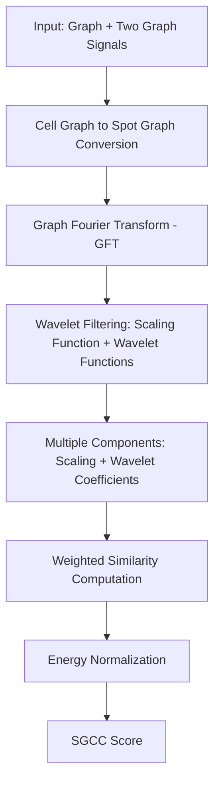

# BioGSP: Biological Graph Signal Processing for Spatial Data Analysis

## Overview

The BioGSP package provides a comprehensive implementation of Graph Signal Processing (GSP) methods including Spectral Graph Wavelet Transform (SGWT) for analyzing spatial patterns in biological data. This implementation is based on Hammond, Vandergheynst, and Gribonval (2011) "Wavelets on Graphs via Spectral Graph Theory" and provides tools for multi-scale analysis of spatial signals, including forward and inverse transforms, energy analysis, and visualization functions tailored for biological applications.

## SGWT Object Structure

When you run `SGWT()`, it returns a list containing all the components of the spectral graph wavelet transform analysis. Here's the detailed structure and meaning of each component based on the actual implementation:

### Main SGWT Result Object

```r
sgwt_result <- SGWT(data.in = your_data, signal = "signal", k = 25, J = 4)

# Structure (when return_all = TRUE, which is default):
sgwt_result$
├── decomposition        # SGWT decomposition results from sgwt_forward()
├── reconstructed_signal # Reconstructed signal from inverse transform
├── reconstruction_error # RMSE between original and reconstructed signal
├── original_signal     # Original input signal values
├── graph_info          # Graph construction information
├── data               # Original input data frame
└── parameters         # Analysis parameters used
```

### Detailed Component Descriptions

#### 1. **`decomposition`** (List)
- **Type**: List containing the core SGWT decomposition results
- **Content**: Output from `sgwt_forward()` function
- **Components**:
  ```r
  decomposition$
  ├── coefficients      # List of coefficient vectors for each scale
  │   ├── scaling       # Scaling function coefficients (low-pass/approximation)
  │   ├── wavelet_scale_1 # Wavelet coefficients at scale 1 (finest scale)
  │   ├── wavelet_scale_2 # Wavelet coefficients at scale 2
  │   └── ...           # Additional scales up to J
  ├── filters           # List of filter values in spectral domain
  ├── scales           # Vector of scale parameters used
  ├── eigenvalues      # Eigenvalues of the graph Laplacian
  └── eigenvectors     # Eigenvectors of the graph Laplacian
  ```
- **Meaning**: The actual multi-scale wavelet decomposition of your spatial signal
- **Interpretation**: 
  - `coefficients$scaling`: Smooth, low-frequency approximation of the signal
  - `coefficients$wavelet_scale_*`: Detail coefficients at different spatial scales
  - Higher scale numbers → coarser spatial details
  - Lower scale numbers → finer spatial details

#### 2. **`reconstructed_signal`** (Vector)
- **Type**: Numeric vector of length N (where N = number of spatial points)
- **Content**: Signal reconstructed from the SGWT decomposition using inverse transform
- **Meaning**: Result of `sgwt_inverse()` applied to the decomposition
- **Quality Check**: Should closely match `original_signal` (check `reconstruction_error`)
- **Interpretation**: Validates the perfect reconstruction property of the transform

#### 3. **`reconstruction_error`** (Scalar)
- **Type**: Single numeric value
- **Content**: Root Mean Square Error between original and reconstructed signal
- **Formula**: `sqrt(mean((original_signal - reconstructed_signal)^2))`
- **Interpretation**: 
  - Values close to 0 indicate perfect reconstruction
  - Higher values may indicate numerical issues or implementation problems
- **Usage**: Quality control metric for the transform

#### 4. **`original_signal`** (Vector)
- **Type**: Numeric vector of length N
- **Content**: The original signal values that were analyzed
- **Meaning**: Copy of the input signal for reference and validation
- **Interpretation**: Baseline for comparison with reconstructed signal

#### 5. **`graph_info`** (List)
- **Components**:
  ```r
  graph_info$
  ├── adjacency_matrix    # Sparse adjacency matrix of the spatial graph
  ├── laplacian_matrix    # Graph Laplacian matrix (normalized/unnormalized)
  ├── eigenvalues         # Eigenvalues of the Laplacian
  └── eigenvectors        # Eigenvectors of the Laplacian
  ```
- **Meaning**: Complete spectral information about the spatial graph structure
- **Interpretation**: Contains all graph-theoretic information needed for analysis and visualization

#### 6. **`data`** (Data Frame)
- **Type**: Data frame (copy of original input)
- **Content**: Original input data with spatial coordinates and signal
- **Meaning**: Preserves the original input for reference and further analysis
- **Usage**: Needed for visualization functions and further processing

#### 7. **`parameters`** (List)
- **Components**:
  ```r
  parameters$
  ├── k                   # Number of nearest neighbors used
  ├── scales             # Vector of scales used in the transform
  ├── J                  # Number of wavelet scales
  ├── kernel_type        # Wavelet kernel type used
  └── laplacian_type     # Type of Laplacian normalization
  ```
- **Meaning**: All parameters used in the analysis for reproducibility
- **Interpretation**: Enables exact reproduction of results and parameter tracking

### Usage Examples

```r
# Access the core decomposition
decomp <- sgwt_result$decomposition

# Access specific coefficient components
scaling_coeffs <- decomp$coefficients$scaling          # Low-frequency approximation
wavelet_1 <- decomp$coefficients$wavelet_scale_1       # Finest scale details
wavelet_2 <- decomp$coefficients$wavelet_scale_2       # Medium scale details
# ... additional scales as wavelet_scale_3, wavelet_scale_4, etc.

# Access filter information
filters <- decomp$filters                              # Spectral domain filters
scales_used <- decomp$scales                           # Scale parameters
eigenvals <- decomp$eigenvalues                        # Graph eigenvalues
eigenvecs <- decomp$eigenvectors                       # Graph eigenvectors

# Check reconstruction quality
error <- sgwt_result$reconstruction_error
print(paste("Reconstruction RMSE:", round(error, 10)))

# Get graph properties
eigenvalues <- sgwt_result$graph_info$eigenvalues
eigenvectors <- sgwt_result$graph_info$eigenvectors
adjacency <- sgwt_result$graph_info$adjacency_matrix

# Access parameters
scales_used <- sgwt_result$parameters$scales
k_neighbors <- sgwt_result$parameters$k
kernel_type <- sgwt_result$parameters$kernel_type

# Compare original vs reconstructed
original <- sgwt_result$original_signal
reconstructed <- sgwt_result$reconstructed_signal
plot(original, reconstructed)
abline(0, 1, col = "red")  # Perfect reconstruction line

# Analyze energy at each scale
scaling_energy <- sum(scaling_coeffs^2)
wavelet_energies <- sapply(seq_along(scales_used), function(i) {
  coeff_name <- paste0("wavelet_scale_", i)
  sum(decomp$coefficients[[coeff_name]]^2)
})
print("Energy distribution:")
print(c(scaling = scaling_energy, wavelet_energies))
```

### Working with the Decomposition

```r
# The decomposition contains the actual wavelet analysis results
# Use helper functions to analyze the decomposition:
energy_analysis <- sgwt_energy_analysis(sgwt_result)

# Visualize the results
plots <- plot_sgwt_decomposition(sgwt_result, sgwt_result$data)
```

### Simplified Output Option

```r
# If you only need the decomposition (return_all = FALSE):
decomp_only <- SGWT(data.in = your_data, signal = "signal", 
                    k = 25, J = 4, return_all = FALSE)
# Returns only the sgwt_forward() result
```

## Features

- **Multi-scale Analysis**: Decompose spatial signals into different frequency components
- **Graph Construction**: Automatic graph construction from spatial coordinates
- **Flexible Kernels**: Support for Mexican hat and Meyer wavelet kernels
- **Energy Analysis**: Analyze energy distribution across different scales
- **Visualization Tools**: Comprehensive plotting functions for results visualization
- **Reconstruction**: Perfect reconstruction capabilities with error analysis
- **SGCC Pipeline**: Spectral Graph Cross-Correlation for comparing graph signals
- **Minimal Dependencies**: Custom implementations reduce external package requirements

## SGCC Workflow Pipeline

The Spectral Graph Cross-Correlation (SGCC) pipeline enables comparison of two graph signals through a comprehensive multi-step process:

### Pipeline Overview



### Detailed Workflow Steps

#### 1. **Input Graph and Two Graph Signals**
The pipeline starts with:
- A graph structure (e.g., cell graph, spot graph)
- Two associated graph signals to be compared
- Spatial coordinates defining the graph topology

#### 2. **Cell Graph to Spot Graph Conversion**
- Converts the graph representation to ensure both signals are in the same graph signal representation space
- Standardizes the graph structure for consistent analysis
- Maintains spatial relationships while enabling cross-modal comparison

#### 3. **Graph Fourier Transform (GFT)**
- **Input**: Node-domain features (signal values on graph nodes)
- **Output**: Spectral-domain features (frequency components of graph signals)
- Transforms spatial signals into the frequency domain using graph Laplacian eigendecomposition
- Enables frequency-based analysis of spatial patterns

#### 4. **Wavelet Filtering: Scaling Function + Wavelet Functions**
- Applies wavelet filter bank to the spectral-domain signals
- Uses scaling function for low-frequency (approximation) components
- Uses multiple wavelet functions at different scales for detail components
- Generates multi-scale decomposition in the spectral domain

#### 5. **Multiple Components: Scaling + Wavelet Coefficients**
- **Output**: Decomposed signal components at multiple scales
- **Scaling coefficients**: Low-frequency approximation of the signal
- **Wavelet coefficients**: Detail coefficients at different spatial scales (scale 1, scale 2, ..., scale J)
- Each component captures different frequency characteristics of the spatial signal

#### 6. **Weighted Similarity Computation**
- Extracted multi-scale features are compared by computing similarity scores
- Similarity computed across graph nodes or spots
- Incorporates spatial weighting based on graph structure
- Accounts for both spectral and spatial relationships

#### 7. **Energy Normalization**
- Ensures similarity measures are normalized by the energy of the signals
- Provides fair comparison across different signal magnitudes
- Accounts for signal power variations
- Enables robust cross-correlation measurement

#### 8. **SGCC Score**
- **Final Output**: Spectral Graph Cross-Correlation score between the two signals
- Quantifies the similarity between graph signals in the spectral domain
- Ranges typically from -1 to 1 (depending on normalization)
- Higher scores indicate greater spectral similarity

## Installation

The package will automatically install all required dependencies. If you encounter any dependency issues, you can manually install them first:

```r
# Manual dependency installation (if needed)
install.packages(c("Matrix", "igraph", "RANN", "RSpectra", "kneedle", 
                   "ggplot2", "patchwork", "ggpubr", "viridis"))
```

You can install BioGSP directly from GitHub:

```r
# Install devtools if you haven't already
if (!requireNamespace("devtools", quietly = TRUE)) {
  install.packages("devtools")
}

# Install BioGSP from GitHub
devtools::install_github("BMEngineeR/BioGSP")
```


### Dependencies

The package requires the following R packages:

**Required:**
- Matrix
- igraph  
- RANN
- RSpectra
- kneedle
- ggplot2
- patchwork
- ggpubr
- viridis
- methods

**Suggested:**
- spdep
- spatialEco
- sp
- gasper
- egg
- knitr
- rmarkdown
- testthat
- dplyr
- tidyr

## Quick Start

### Basic SGWT Analysis

```r
library(BioGSP)

# Generate synthetic spatial data
set.seed(123)
n_points <- 100
x_coords <- rep(1:10, each = 10) + rnorm(n_points, 0, 0.1)
y_coords <- rep(1:10, times = 10) + rnorm(n_points, 0, 0.1)
signal_data <- sin(0.5 * x_coords) * cos(0.3 * y_coords) + rnorm(n_points, 0, 0.1)

demo_data <- data.frame(x = x_coords, y = y_coords, signal = signal_data)

# Apply SGWT
result <- SGWT(data.in = demo_data, signal = "signal", k = 8, J = 4)

# View reconstruction error
print(result$reconstruction_error)

# Analyze energy distribution
energy_analysis <- sgwt_energy_analysis(result)
print(energy_analysis)

# Visualize results
plots <- plot_sgwt_decomposition(result, demo_data)
print(plots)
```

### SGCC Pipeline Example

```r
library(BioGSP)

# Generate two related spatial signals for comparison
set.seed(123)
n_points <- 100
x_coords <- rep(1:10, each = 10) + rnorm(n_points, 0, 0.1)
y_coords <- rep(1:10, times = 10) + rnorm(n_points, 0, 0.1)

# Signal 1: Original pattern
signal1 <- sin(0.5 * x_coords) * cos(0.3 * y_coords) + rnorm(n_points, 0, 0.1)

# Signal 2: Related pattern with some variation
signal2 <- sin(0.4 * x_coords) * cos(0.35 * y_coords) + rnorm(n_points, 0, 0.15)

# Create data frame
comparison_data <- data.frame(
  x = x_coords, 
  y = y_coords, 
  signal1 = signal1,
  signal2 = signal2
)

# Step 1: Calculate eigendecomposition for the spatial data
eigen_result <- Cal_Eigen(comparison_data, k = 25, k_fold = 15)
knee_point <- eigen_result[[1]]
eigenvectors <- eigen_result[[2]]

# Step 2: Calculate SGCC score between the two signals
# Using the new comprehensive similarity function
sgcc_score <- sgwt_similarity("signal1", "signal2", 
                             data.in = comparison_data, 
                             k = 25, J = 4)

print(paste("SGCC Score:", round(sgcc_score, 4)))

# Step 3: Individual SGWT analysis for each signal
result1 <- SGWT(data.in = comparison_data, signal = "signal1", k = 25, J = 4)
result2 <- SGWT(data.in = comparison_data, signal = "signal2", k = 25, J = 4)

# Step 4: Energy analysis comparison
energy1 <- sgwt_energy_analysis(result1)
energy2 <- sgwt_energy_analysis(result2)

print("Energy Distribution Comparison:")
print(cbind(Signal1 = energy1$energy_ratio, Signal2 = energy2$energy_ratio))
```

## Main Functions

### Core Functions

- `SGWT()`: Main function for SGWT analysis
- `sgwt_forward()`: Forward SGWT transform
- `sgwt_inverse()`: Inverse SGWT transform
- `sgwt_energy_analysis()`: Energy distribution analysis

### Utility Functions

- `cal_laplacian()`: Calculate graph Laplacian matrices
- `FastDecompositionLap()`: Fast eigendecomposition
- `gft()`: Graph Fourier Transform
- `Cal_Eigen()`: Eigenvalue analysis with knee detection
- `sgwt_similarity()`: Comprehensive signal similarity analysis
- `sgwt_weighted_similarity()`: Energy-normalized weighted similarity between SGWT results
- `Cal_GCC()`: Graph Cross-Correlation (deprecated - use `sgwt_similarity()` instead)
- `cosine_similarity()`: Custom cosine similarity implementation

### Visualization Functions

- `plot_sgwt_decomposition()`: Visualize SGWT components
- `demo_sgwt()`: Demonstration with synthetic data

### Kernel Functions

- `sgwt_kernel()`: Wavelet kernel functions
- `sgwt_scaling_kernel()`: Scaling function kernel
- `compute_sgwt_filters()`: Compute filter bank
- `sgwt_auto_scales()`: Automatic scale generation

## Usage Examples

### Basic SGWT Analysis

```r
# Load your spatial data with x, y coordinates and a signal
# data should have columns: x, y, signal

result <- SGWT(data.in = your_data, 
               signal = "signal",
               k = 25,              # number of nearest neighbors
               J = 5,               # number of scales
               scaling_factor = 2,   # scale separation factor
               kernel_type = "mexican_hat",
               laplacian_type = "normalized")
```

### Custom Scale Analysis

```r
# Define custom scales
custom_scales <- c(2.0, 1.0, 0.5, 0.25, 0.125)

result <- SGWT(data.in = your_data,
               signal = "signal",
               scales = custom_scales,
               k = 20)
```

### Energy Analysis

```r
# Analyze energy distribution across scales
energy_df <- sgwt_energy_analysis(result)

# View energy ratios
print(energy_df)

# Plot energy distribution
library(ggplot2)
ggplot(energy_df, aes(x = scale, y = energy_ratio)) +
  geom_bar(stat = "identity") +
  theme_minimal()
```

### Cross-Correlation Analysis

```r
# Calculate eigendecomposition for your spatial data
eigen_result <- Cal_Eigen(your_data, k = 25, k_fold = 15)

# Calculate cross-correlation between two signals
# NEW RECOMMENDED APPROACH:
similarity_score <- sgwt_similarity("signal1", "signal2", data.in = your_data, k = 25, J = 4)

# OR with pre-computed SGWT results:
# sgwt1 <- SGWT(your_data, signal = "signal1", k = 25, J = 4)
# sgwt2 <- SGWT(your_data, signal = "signal2", k = 25, J = 4)
# similarity_score <- sgwt_similarity(sgwt1, sgwt2)
```

### Custom Cosine Similarity

```r
# Use the built-in cosine similarity function
x <- c(1, 2, 3, 4)
y <- c(2, 3, 4, 5)
similarity <- cosine_similarity(x, y)
print(similarity)
```

## Applications

The BioGSP package is particularly useful for:

### Biological Applications
- **Spatial Transcriptomics**: Comparing gene expression patterns across tissue regions
- **Single-cell Analysis**: Cross-correlation between cell populations and spatial locations
- **Tissue Architecture**: Analyzing spatial organization of cellular structures
- **Developmental Biology**: Tracking pattern formation and morphogenesis
- **Cancer Research**: Identifying spatial heterogeneity in tumor microenvironments

### General Applications
- **Neuroscience**: Brain connectivity and neural signal analysis
- **Environmental Science**: Spatial pattern analysis in ecological data
- **Image Processing**: Multi-scale image analysis on irregular domains
- **Social Networks**: Analyzing signals on social network graphs
- **Sensor Networks**: Spatial correlation analysis in distributed sensing

### SGCC-Specific Use Cases
- **Cross-modal Comparison**: Correlating different measurement modalities on the same spatial domain
- **Temporal Analysis**: Comparing spatial patterns across time points
- **Batch Effect Correction**: Identifying and correcting systematic differences between datasets
- **Quality Control**: Assessing spatial consistency in high-throughput experiments
- **Pattern Discovery**: Finding recurring spatial motifs across different samples

## Theory

The Spectral Graph Wavelet Transform extends classical wavelet analysis to graphs and irregular domains. Key concepts:

1. **Graph Construction**: Build a graph from spatial coordinates using k-nearest neighbors
2. **Spectral Domain**: Use graph Laplacian eigendecomposition to define frequency
3. **Wavelet Design**: Create wavelets in the spectral domain using kernel functions
4. **Multi-scale Analysis**: Analyze signals at different scales simultaneously

### Mathematical Foundation

For a signal f on a graph G with Laplacian L and eigenvectors {χₗ}, the SGWT coefficients are:

- Scaling coefficients: Wf(λ) = ⟨f, hχₗ⟩
- Wavelet coefficients: Wf(j,λ) = ⟨f, gⱼχₗ⟩

Where h is the scaling function and gⱼ are wavelets at different scales.

### SGCC Mathematical Framework

The Spectral Graph Cross-Correlation extends traditional cross-correlation to graph signals:

1. **Graph Fourier Transform**: For signals f₁, f₂ on graph G:
   - f̂₁(λᵢ) = ⟨f₁, χᵢ⟩ and f̂₂(λᵢ) = ⟨f₂, χᵢ⟩

2. **Spectral Cross-Correlation**: 
   - SGCC(f₁, f₂) = Σᵢ w(λᵢ) · f̂₁(λᵢ) · f̂₂*(λᵢ) / √(E₁ · E₂)
   
3. **Energy Normalization**:
   - E₁ = Σᵢ |f̂₁(λᵢ)|², E₂ = Σᵢ |f̂₂(λᵢ)|²
   
4. **Wavelet-based Features**:
   - Multi-scale decomposition: Wf(j,n) = Σᵢ gⱼ(λᵢ) f̂(λᵢ) χᵢ(n)

Where w(λᵢ) are frequency-dependent weights and gⱼ(λᵢ) are wavelet kernels at scale j.

## Implementation Notes

### Reduced Dependencies
This package implements its own cosine similarity function to reduce dependencies. The custom implementation provides the same functionality as external libraries while minimizing package requirements.

### Performance Considerations
- Uses sparse matrix operations where possible
- Implements fast eigendecomposition for large matrices
- Optimized graph construction using k-nearest neighbors

### Recent Improvements
- **Unified Similarity Analysis**: New `sgwt_similarity()` function provides comprehensive signal similarity analysis with support for multiple input types (raw signals, SGWT results, mixed inputs)
- **Enhanced Numerical Stability**: Improved `cosine_similarity()` function with epsilon-based numerical stability and value clamping
- **Energy-Normalized Weighting**: Advanced `sgwt_weighted_similarity()` function computes energy-normalized weighted similarity between SGWT decompositions
- **Deprecation Management**: `Cal_GCC()` function deprecated in favor of more comprehensive similarity analysis methods

## References

1. Hammond, D. K., Vandergheynst, P., & Gribonval, R. (2011). Wavelets on graphs via spectral graph theory. Applied and Computational Harmonic Analysis, 30(2), 129-150.

2. Shuman, D. I., Narang, S. K., Frossard, P., Ortega, A., & Vandergheynst, P. (2013). The emerging field of signal processing on graphs: Extending high-dimensional data analysis to networks and other irregular domains. IEEE signal processing magazine, 30(3), 83-98.

## License

GPL-3

## Contributing

Contributions are welcome! Please feel free to submit issues and pull requests.

## Contact

For questions and support, please open an issue on the GitHub repository. 